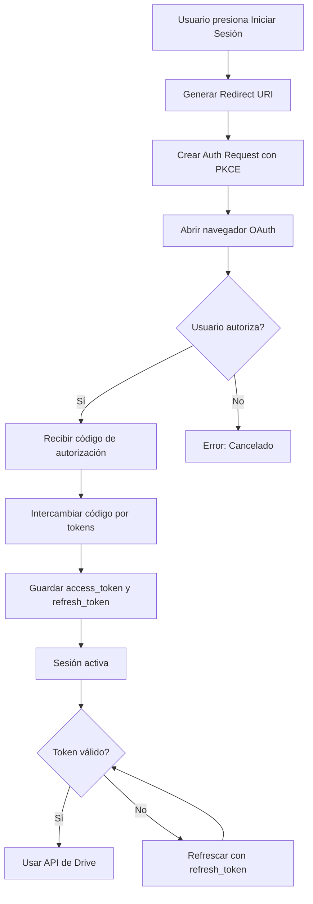

# 🔐 Guía Completa: Autenticación OAuth 2.0 con Google Drive

## 📋 Índice
1. [Cambios Realizados](#cambios-realizados)
2. [Configuración en Google Cloud Console](#configuración-en-google-cloud-console)
3. [Flujo de Autenticación Mejorado](#flujo-de-autenticación-mejorado)
4. [Cómo Usar](#cómo-usar)
5. [Solución de Problemas](#solución-de-problemas)
6. [Mejores Prácticas](#mejores-prácticas)

---

## ✨ Cambios Realizados

### 🔄 **1. Flujo de Autorización Mejorado (Authorization Code Flow)**

**Antes:**
- Usaba `ResponseType.Token` (Implicit Flow)
- Menos seguro, sin refresh token
- Token expiraba sin posibilidad de renovación automática

**Ahora:**
- Usa `ResponseType.Code` (Authorization Code Flow)
- Implementa PKCE (Proof Key for Code Exchange) para mayor seguridad
- Obtiene **refresh token** para renovación automática
- Sesión persistente sin necesidad de reautenticar

### 🔑 **2. Gestión Avanzada de Tokens**

```javascript
// Nuevas funcionalidades:
✅ Almacenamiento de access_token y refresh_token
✅ Detección automática de expiración
✅ Renovación automática con refresh token
✅ Verificación antes de cada petición a Drive
✅ Revocación de token al cerrar sesión
```

### 🛡️ **3. Manejo Robusto de Errores**

- **Mensajes claros y específicos** para cada tipo de error
- **Instrucciones detalladas** en logs de consola
- **Detección automática** de problemas de configuración:
  - Redirect URI no coincide
  - Usuario no autorizado
  - Client ID inválido
  - Token expirado
  - Sin conexión

### ⚡ **4. Mejoras en la UX**

- Logs informativos durante el proceso
- Reintento automático en caso de token expirado
- Mensajes de usuario más amigables en la UI
- Indicador de progreso durante operaciones

---

## 🔧 Configuración en Google Cloud Console

### **Paso 1: Obtener el Redirect URI**

Cuando ejecutes la app por primera vez e intentes autenticarte, verás en la consola:

```
═══════════════════════════════════════════════════════════════
🚀 INICIANDO AUTENTICACIÓN CON GOOGLE DRIVE
═══════════════════════════════════════════════════════════════

📋 CONFIGURACIÓN ACTUAL:

  • Client ID: 69547892797-le20h0g69kk2s48lvvpjjdfnsg3kh20r...
  • Redirect URI: https://auth.expo.io/@tu-usuario/tu-app
  • Scopes: drive.file, drive.appdata
```

**COPIA** el Redirect URI exacto que aparece.

---

### **Paso 2: Configurar en Google Cloud Console**

#### 🌐 **2.1. Ir a Credenciales**

1. Ve a: https://console.cloud.google.com/apis/credentials
2. Busca tu **Client ID Web** (no el de Android)
3. Haz clic en el ícono de **lápiz ✏️** (editar)

#### 🔗 **2.2. Agregar Redirect URI**

1. En la sección **"URIs de redireccionamiento autorizados"**
2. Haz clic en **"+ AÑADIR URI"**
3. **PEGA** el URI exacto de la consola:
   ```
   https://auth.expo.io/@tu-usuario/tu-app
   ```
4. Haz clic en **"GUARDAR"**
5. ⏱️ **ESPERA 5 MINUTOS** para que se apliquen los cambios

#### 👥 **2.3. Agregar Usuarios de Prueba**

1. Ve a: https://console.cloud.google.com/apis/credentials/consent
2. En **"Usuarios de prueba"**, haz clic en **"+ ADD USERS"**
3. Agrega tu **email de Google** (el que usarás para iniciar sesión)
4. Haz clic en **"GUARDAR"**

#### ✅ **2.4. Verificar Scopes**

En la misma pantalla de consentimiento, verifica que estén estos scopes:

```
✓ https://www.googleapis.com/auth/drive.file
✓ https://www.googleapis.com/auth/drive.appdata
```

---

## 🔄 Flujo de Autenticación Mejorado



### **Ventajas del nuevo flujo:**

| Característica | Antes (Implicit) | Ahora (Code + PKCE) |
|----------------|------------------|---------------------|
| Seguridad | ⚠️ Baja | ✅ Alta |
| Refresh Token | ❌ No | ✅ Sí |
| Renovación Auto | ❌ No | ✅ Sí |
| Duración Sesión | 1 hora | ♾️ Permanente |
| PKCE | ❌ No | ✅ Sí |

---

## 🚀 Cómo Usar

### **1. Iniciar Sesión**

```javascript
// En tu componente React
import googleDriveService from '../services/googleDriveService';

const handleLogin = async () => {
  const result = await googleDriveService.authenticate();
  
  if (result.success) {
    Alert.alert('✅ Éxito', 'Conectado con Google Drive');
  } else {
    Alert.alert('Error', result.error);
  }
};
```

**El servicio automáticamente:**
- ✅ Genera el redirect URI
- ✅ Obtiene el código de autorización
- ✅ Intercambia el código por tokens
- ✅ Guarda los tokens de forma segura
- ✅ Muestra logs detallados en consola

---

### **2. Usar el Servicio**

```javascript
// Subir respaldo
const backup = await backupService.saveBackupToDrive();

// El servicio automáticamente:
// 1. Verifica si el token es válido
// 2. Si está por expirar, lo refresca automáticamente
// 3. Si expiró, intenta renovarlo con refresh token
// 4. Si no puede renovar, retorna { needsAuth: true }
```

---

### **3. Verificar Autenticación**

```javascript
const isAuth = await googleDriveService.isAuthenticated();

if (isAuth) {
  console.log('✅ Usuario autenticado');
} else {
  console.log('❌ Necesita autenticar');
}
```

---

### **4. Cerrar Sesión**

```javascript
const result = await googleDriveService.logout();

// El servicio automáticamente:
// 1. Revoca el token en Google
// 2. Elimina tokens de AsyncStorage
// 3. Limpia la memoria
```

---

## 🐛 Solución de Problemas

### **Error: "redirect_uri_mismatch"**

**Causa:** El Redirect URI no está agregado en Google Cloud Console.

**Solución:**
1. Copia el URI exacto de los logs de la consola
2. Ve a Google Cloud Console > Credenciales
3. Edita tu Client ID Web
4. Agrega el URI en "URIs de redireccionamiento autorizados"
5. Espera 5 minutos
6. Intenta de nuevo

---

### **Error: "access_denied" o "unauthorized_client"**

**Causa:** Tu email no está en la lista de usuarios de prueba.

**Solución:**
1. Ve a: https://console.cloud.google.com/apis/credentials/consent
2. En "Usuarios de prueba", haz clic en "+ ADD USERS"
3. Agrega tu email de Google
4. Intenta de nuevo

---

### **Error: "invalid_client"**

**Causa:** El Client ID es incorrecto o no está configurado.

**Solución:**
1. Verifica que `GOOGLE_WEB_CLIENT_ID` en `googleDriveService.js` sea correcto
2. Asegúrate de usar el Client ID **Web**, no el de Android
3. Verifica en: https://console.cloud.google.com/apis/credentials

---

### **Error: "Token expirado"**

**Causa:** El access token expiró y no hay refresh token.

**Solución:**
- Con el nuevo sistema, esto **NO debería pasar**
- El token se renueva automáticamente con refresh token
- Si pasa, cierra sesión y vuelve a autenticar

---

### **Error: "Usuario no autorizado"**

**Causas posibles:**
1. Email no está en usuarios de prueba
2. Pantalla de consentimiento no publicada
3. Scopes no autorizados

**Solución completa:**

#### **Opción A: Mantener en modo Testing (Recomendado para desarrollo)**

```
1. Ve a: https://console.cloud.google.com/apis/credentials/consent
2. Verifica que el estado sea "Testing"
3. En "Usuarios de prueba", agrega TODOS los emails que usarás
4. Verifica que los scopes incluyan:
   - https://www.googleapis.com/auth/drive.file
   - https://www.googleapis.com/auth/drive.appdata
5. Guarda cambios
```

#### **Opción B: Publicar la app (Para producción)**

```
1. Ve a: https://console.cloud.google.com/apis/credentials/consent
2. Completa TODA la información requerida:
   - Nombre de la app
   - Logo
   - Política de privacidad
   - Términos de servicio
3. Haz clic en "PUBLISH APP"
4. Espera verificación de Google (puede tardar días/semanas)
```

---

## 🎯 Mejores Prácticas

### **1. Durante el Desarrollo**

```javascript
// Siempre revisa los logs de consola
console.log('═══════════════════════════════════════════════════════════════');
console.log('🚀 INICIANDO AUTENTICACIÓN CON GOOGLE DRIVE');
console.log('═══════════════════════════════════════════════════════════════');

// El servicio te mostrará:
// - El Redirect URI exacto
// - Instrucciones de configuración
// - Errores específicos con soluciones
```

---

### **2. Manejo de Errores en UI**

```javascript
const handleBackup = async () => {
  try {
    setLoading(true);
    const result = await backupService.saveBackupToDrive();
    
    if (result.success) {
      Alert.alert('✅ Éxito', result.message);
    } else if (result.needsAuth) {
      // Token expirado, pedir reautenticación
      Alert.alert(
        'Sesión expirada',
        'Por favor, vuelve a iniciar sesión',
        [
          { text: 'Cancelar', style: 'cancel' },
          { text: 'Iniciar sesión', onPress: () => handleAuthenticate() }
        ]
      );
    } else {
      Alert.alert('Error', result.error);
    }
  } catch (error) {
    Alert.alert('Error', error.message);
  } finally {
    setLoading(false);
  }
};
```

---

### **3. Verificar Estado Antes de Operaciones**

```javascript
// El servicio ya lo hace automáticamente, pero puedes verificar:
const canUseService = await googleDriveService.isAuthenticated();

if (!canUseService) {
  // Mostrar botón de login
}
```

---

### **4. Testing**

```javascript
// Para probar la renovación automática de tokens:

// 1. Autentícate normalmente
await googleDriveService.authenticate();

// 2. Modifica manualmente la fecha de expiración (solo para testing)
// En AsyncStorage, cambia TOKEN_EXPIRY_KEY a una fecha pasada

// 3. Haz una operación (subir/descargar)
await backupService.saveBackupToDrive();

// El servicio detectará que el token expiró y lo renovará automáticamente
```

---

## 📊 Logs de Depuración

El servicio genera logs detallados. Ejemplos:

### **✅ Autenticación Exitosa**

```
═══════════════════════════════════════════════════════════════
🚀 INICIANDO AUTENTICACIÓN CON GOOGLE DRIVE
═══════════════════════════════════════════════════════════════

📋 CONFIGURACIÓN ACTUAL:
  • Client ID: 69547892797-le20h0g69kk2s48lvvpjjdfnsg3kh20r...
  • Redirect URI: https://auth.expo.io/@raudy/smallbtrucks
  • Scopes: drive.file, drive.appdata

🌐 Abriendo navegador para autenticación...
📊 Resultado de autenticación: success
✅ Código de autorización recibido
🔄 Intercambiando código por token de acceso...
✅ TOKEN DE ACCESO OBTENIDO
⏱️  Expira en: 3600 segundos
🔐 Refresh token: Sí

═══════════════════════════════════════════════════════════════
```

### **🔄 Renovación Automática**

```
🔄 Token por expirar, refrescando...
🔄 Refrescando token de acceso...
✅ Token refrescado exitosamente
```

### **❌ Error de Configuración**

```
❌ ERROR: Redirect URI no coincide

SOLUCIÓN:
1. Agrega este URI exacto: https://auth.expo.io/@raudy/smallbtrucks
2. Espera 5 minutos
3. Intenta de nuevo
```

---

## 🎓 Conceptos Clave

### **¿Qué es PKCE?**

**PKCE (Proof Key for Code Exchange)** es una extensión de OAuth 2.0 que agrega una capa extra de seguridad:

1. Se genera un `code_verifier` aleatorio
2. Se crea un `code_challenge` hasheando el verifier
3. El challenge se envía con la petición de autorización
4. Al intercambiar el código, se envía el verifier original
5. Google verifica que coincidan

**Beneficio:** Previene ataques de interceptación del código de autorización.

---

### **¿Por qué Code Flow en lugar de Implicit Flow?**

| Aspecto | Implicit Flow | Code Flow + PKCE |
|---------|---------------|------------------|
| Token en URL | ✅ Sí (inseguro) | ❌ No |
| Refresh Token | ❌ No | ✅ Sí |
| Duración | 1 hora | Renovable |
| Seguridad | ⚠️ Baja | ✅ Alta |
| Recomendado | ❌ No | ✅ Sí |

---

## 📞 Soporte

Si sigues teniendo problemas:

1. **Revisa los logs de consola** - El servicio da instrucciones detalladas
2. **Verifica la configuración** en Google Cloud Console
3. **Espera 5 minutos** después de cada cambio en Google Console
4. **Prueba con Incógnito** para descartar problemas de caché
5. **Revisa el email de usuario de prueba** - Debe ser exactamente el mismo

---

## 📚 Referencias

- [Google OAuth 2.0 Documentation](https://developers.google.com/identity/protocols/oauth2)
- [Expo AuthSession Docs](https://docs.expo.dev/versions/latest/sdk/auth-session/)
- [Google Drive API v3](https://developers.google.com/drive/api/v3/reference)
- [RFC 7636 - PKCE](https://tools.ietf.org/html/rfc7636)

---

**✨ Con estos cambios, tu app tiene un sistema de autenticación robusto, seguro y fácil de usar!**
