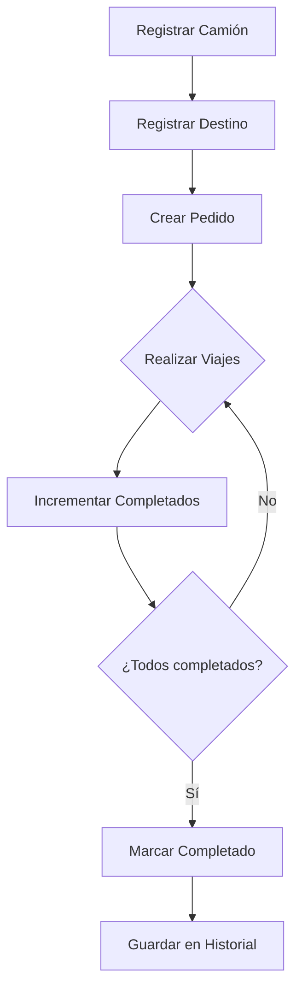

# 🚚 CamionesMobile - Sistema de Gestión de Transporte

<div align="center">


**Aplicación móvil completa para la gestión eficiente de flotas de transporte de camiones**

[Características](#-características) • [Instalación](#-instalación) • [Tecnologías](#-tecnologías) • [Capturas](#-capturas-de-pantalla) • [Licencia](#-licencia)

</div>

---

## 📋 Descripción

**CamionesMobile** es una aplicación móvil diseñada para empresas de transporte que necesitan gestionar sus operaciones de manera eficiente. Permite llevar un control completo de camiones, destinos, pedidos y viajes realizados, con un sistema de historial detallado y estadísticas en tiempo real.

### 🎯 Problema que resuelve

Las empresas de transporte necesitan:
- ✅ Rastrear el estado de sus pedidos en tiempo real
- ✅ Conocer cuántos viajes ha realizado cada camión
- ✅ Mantener un historial completo de entregas
- ✅ Programar viajes futuros
- ✅ Ver estadísticas de rendimiento

---

## ✨ Características

### 🚛 Gestión de Camiones
- Registro de camiones con nombre y placa
- Estados: Activo/Inactivo
- Contador de viajes realizados
- Búsqueda y filtrado por nombre o placa
- Vista detallada con historial de pedidos

### 📍 Gestión de Destinos
- Registro de destinos con ubicación
- Búsqueda por nombre o ubicación
- Organización de rutas frecuentes

### 📦 Gestión de Pedidos
- Creación de pedidos asignando camión y destino
- Definir cantidad de viajes por pedido
- Fechas programadas para entregas futuras
- Estados: "En Progreso" y "Completado"
- Seguimiento de progreso en tiempo real
- Incremento/decremento manual de viajes completados

### 📊 Panel de Control
- **Total de Pedidos**: Vista general de todos los pedidos
- **Viajes de la Semana**: Contador de viajes en los últimos 7 días
- **Pedidos en Proceso**: Seguimiento de entregas activas
- **Pedidos Completados**: Historial de éxito
- Actualización automática cada 5 segundos

### 📅 Historial Completo
- Registro detallado de cada entrega con fecha
- Filtros avanzados:
  - Por camión específico
  - Por destino
  - Por fecha (Hoy, Última semana, Último mes)
  - Por fecha específica (selector nativo)
- Contador dinámico de viajes totales
- Vista agrupada por fechas

### 🔍 Búsqueda y Filtros
- Búsqueda en tiempo real
- Filtros persistentes (se mantienen durante actualizaciones)
- Indicadores visuales de filtros activos

---

## 🛠️ Tecnologías

### Frontend
- **React Native 0.81.5** - Framework principal
- **Expo SDK 54** - Herramientas de desarrollo
- **React Navigation 6** - Navegación entre pantallas
- **@expo-google-fonts/poppins** - Tipografía moderna

### Base de Datos
- **expo-sqlite 16.0.8** - Base de datos local SQLite
- Esquema relacional con integridad referencial
- Migraciones automáticas

### UI/UX
- **@react-native-community/datetimepicker** - Selector de fechas nativo
- Diseño responsive para cualquier tamaño de pantalla
- Tema oscuro profesional
- Componentes reutilizables

### Arquitectura
```
src/
├── components/       # Componentes reutilizables
│   ├── cards.js
│   └── common/
├── database/         # Capa de datos
│   ├── database.js
│   ├── camionService.js
│   ├── destinoService.js
│   ├── viajeService.js
│   └── entregaService.js
├── navigation/       # Configuración de navegación
├── screens/          # Pantallas de la app
├── theme/            # Colores y estilos
└── App.js
```

---

## 🎨 Paleta de Colores

```javascript
// Colores de marca
Primary:    #0D47A1  // Azul oscuro profesional
Secondary:  #F57C00  // Naranja vibrante
Accent:     #1565C0  // Azul medio

// Fondos (tema oscuro)
Background: #1C1C1E  // Negro suave
Cards:      #2C2C2E  // Gris oscuro
Surface:    #3C3C3E  // Gris medio

// Estados
Success:    #43A047  // Verde
Warning:    #FFB300  // Amarillo
Error:      #E53935  // Rojo
Info:       #039BE5  // Cian
```

---

## 🚀 Instalación

### Requisitos previos
- Node.js 18 o superior
- npm o yarn
- Expo CLI
- Dispositivo Android/iOS o emulador

### Pasos de instalación

1. **Clonar el repositorio**
```bash
git clone https://github.com/tu-usuario/CamionesMobile.git
cd CamionesMobile
```

2. **Instalar dependencias**
```bash
npm install
```

3. **Iniciar la aplicación**
```bash
# Desarrollo con Expo
npm start

# O directamente en Android
npm run android

# O en iOS
npm run ios
```

4. **Escanear código QR**
   - Abre la app Expo Go en tu dispositivo
   - Escanea el código QR que aparece en la terminal

---

## 📱 Capturas de Pantalla

```
┌─────────────────────┐  ┌─────────────────────┐  ┌─────────────────────┐
│   Panel Control     │  │  Gestión Camiones   │  │  Historial Viajes   │
│                     │  │                     │  │                     │
│  📊 Estadísticas    │  │  🚛 Lista filtrada  │  │  📅 Por fechas      │
│  🚛 Lista camiones  │  │  🔍 Búsqueda        │  │  🔍 Filtros         │
│  ➕ Acciones        │  │  ➕ Agregar         │  │  📊 Contadores      │
└─────────────────────┘  └─────────────────────┘  └─────────────────────┘
```

---

## 📊 Estructura de la Base de Datos

```sql
-- Tabla de Camiones
CREATE TABLE Camion (
  id INTEGER PRIMARY KEY AUTOINCREMENT,
  nombre TEXT NOT NULL,
  placa TEXT,
  estado TEXT DEFAULT 'activo',
  viajes_realizados INTEGER DEFAULT 0
);

-- Tabla de Destinos
CREATE TABLE Destino (
  id INTEGER PRIMARY KEY AUTOINCREMENT,
  nombre TEXT NOT NULL,
  ubicacion TEXT
);

-- Tabla de Viajes/Pedidos
CREATE TABLE Viaje (
  id INTEGER PRIMARY KEY AUTOINCREMENT,
  camion_id INTEGER NOT NULL,
  destino_id INTEGER NOT NULL,
  fecha_programada TEXT,
  cantidad_viajes INTEGER NOT NULL,
  viajes_realizados INTEGER DEFAULT 0,
  estado TEXT DEFAULT 'En progreso',
  FOREIGN KEY (camion_id) REFERENCES Camion(id),
  FOREIGN KEY (destino_id) REFERENCES Destino(id)
);

-- Tabla de Entregas (Historial)
CREATE TABLE EntregaViaje (
  id INTEGER PRIMARY KEY AUTOINCREMENT,
  viaje_id INTEGER NOT NULL,
  fecha_entrega TEXT NOT NULL,
  FOREIGN KEY (viaje_id) REFERENCES Viaje(id)
);
```

---

## 🔄 Flujo de Trabajo



---

## 🎯 Casos de Uso

### Ejemplo 1: Empresa de Transporte de Materiales
- Registra 10 camiones (F1, F2, F3...)
- Define destinos (CEMEX, Barrick, Cotuí)
- Crea pedido: Camión F1 → 5 viajes a CEMEX
- Va marcando viajes completados
- Revisa historial al final del día/semana

### Ejemplo 2: Logística Diaria
- Consulta panel: "Hoy tengo 15 viajes pendientes"
- Filtra historial por "Última semana"
- Ve que Camión F2 completó 23 viajes
- Planifica mantenimiento basado en uso

---

## 🔐 Reglas de Negocio

1. ✅ **Persistencia**: Los camiones permanecen en el sistema
2. ✅ **Integridad**: No se puede eliminar camión/destino con pedidos asociados
3. ✅ **Control**: No se pueden registrar más viajes de los planeados
4. ✅ **Historial**: Cada viaje completado se registra con fecha exacta
5. ✅ **Estados**: Automáticos según progreso (En Progreso/Completado)
6. ✅ **Actualización**: Auto-refresh cada 5 segundos en pantallas principales

---

## 🤝 Contribuir

Las contribuciones son bienvenidas. Para cambios importantes:

1. Fork el proyecto
2. Crea una rama (`git checkout -b feature/AmazingFeature`)
3. Commit tus cambios (`git commit -m 'Add AmazingFeature'`)
4. Push a la rama (`git push origin feature/AmazingFeature`)
5. Abre un Pull Request

---

## 🐛 Reportar Problemas

Si encuentras un bug o tienes una sugerencia:
- Abre un [Issue](https://github.com/tu-usuario/CamionesMobile/issues)
- Describe el problema detalladamente
- Incluye capturas de pantalla si es posible

---

## 📝 Roadmap

- [ ] Exportar reportes a PDF/Excel
- [ ] Notificaciones push para recordatorios
- [ ] Modo offline completo
- [ ] Dashboard web para administradores
- [ ] Integración con GPS para tracking en tiempo real
- [ ] Múltiples usuarios con roles
- [ ] Cálculo de costos por viaje

---

## 👨‍💻 Autor

**Tu Nombre**
- GitHub: [@tu-usuario](https://github.com/tu-usuario)
- Email: tu-email@example.com

---

## 📄 Licencia

Este proyecto está bajo la Licencia MIT - ver el archivo [LICENSE](LICENSE) para más detalles.

---

## 🙏 Agradecimientos

- [Expo Team](https://expo.dev/) por las excelentes herramientas
- [React Navigation](https://reactnavigation.org/) por la navegación fluida
- Comunidad de React Native por el soporte constante

---

<div align="center">

**⭐ Si este proyecto te resultó útil, considera darle una estrella en GitHub ⭐**

Hecho con ❤️ y ☕ para la comunidad de transporte

</div>
