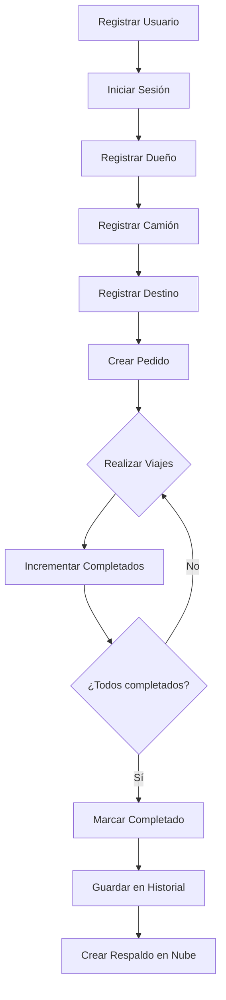

# 🚚 CamionesMobile - Sistema de Gestión de Transporte

<div align="center">


**Aplicación móvil completa para la gestión eficiente de flotas de transporte de camiones con autenticación y respaldos en la nube**

[Características](#-características) • [Instalación](#-instalación) • [Tecnologías](#-tecnologías) • [Capturas](#-capturas-de-pantalla) • [Licencia](#-licencia)

</div>

---

## 📋 Descripción

**CamionesMobile** es una aplicación móvil diseñada para empresas de transporte que necesitan gestionar sus operaciones de manera eficiente. Permite llevar un control completo de camiones, destinos, pedidos y viajes realizados, con un sistema de historial detallado, estadísticas en tiempo real, autenticación de usuarios y respaldos automáticos en la nube.

### 🎯 Problema que resuelve

Las empresas de transporte necesitan:
- ✅ Rastrear el estado de sus pedidos en tiempo real
- ✅ Conocer cuántos viajes ha realizado cada camión
- ✅ Mantener un historial completo de entregas
- ✅ Programar viajes futuros
- ✅ Ver estadísticas de rendimiento
- ✅ Gestión multi-usuario con datos individuales
- ✅ Respaldos seguros en la nube
- ✅ Acceso desde cualquier dispositivo

---

## ✨ Características

### � Autenticación y Seguridad
- Sistema completo de registro y login con Firebase Authentication
- Autenticación por email y contraseña
- Recuperación de contraseña por email
- Datos individuales por usuario (aislamiento completo)
- Sesión persistente automática
- Pantalla de bienvenida personalizada con nombre del usuario

### ☁️ Respaldos en la Nube
- Respaldos automáticos en Firebase Storage
- Cada usuario tiene su propio espacio de almacenamiento
- Restauración de respaldos con un toque
- Eliminación segura de respaldos antiguos
- Lista de respaldos con fecha y hora
- Información del usuario en pantalla de respaldo
- Verificación de conexión a Firebase

### �🚛 Gestión de Camiones
- Registro de camiones con nombre y placa
- Estados: Activo/Inactivo
- Contador de viajes realizados
- Búsqueda y filtrado por nombre o placa
- Vista detallada con historial de pedidos
- Información de dueño de cada camión

### 👤 Gestión de Dueños
- Registro de dueños/propietarios de camiones
- Información de contacto (teléfono, email)
- Relación dueño-camión
- Vista detallada con lista de camiones asignados
- Búsqueda por nombre o contacto

### 📍 Gestión de Destinos
- Registro de destinos con ubicación detallada
- Búsqueda por nombre o ubicación
- Organización de rutas frecuentes
- Visualización de ubicación en tarjetas de viaje

### 📦 Gestión de Pedidos
- Creación de pedidos asignando camión y destino
- Definir cantidad de viajes por pedido
- Fechas programadas para entregas futuras
- Estados: "En Progreso" y "Completado"
- Seguimiento de progreso en tiempo real
- Incremento/decremento manual de viajes completados
- Visualización de ubicación de destino en cada pedido

### 📊 Panel de Control
- **Saludo personalizado**: Muestra nombre del usuario logueado
- **Total de Pedidos**: Vista general de todos los pedidos
- **Viajes de la Semana**: Contador de viajes en los últimos 7 días
- **Pedidos en Proceso**: Seguimiento de entregas activas
- **Pedidos Completados**: Historial de éxito
- **Fecha actual**: Display en formato completo
- Actualización automática cada 5 segundos
- Lista de camiones activos con progreso visual

### 📅 Historial Completo
- Registro detallado de cada entrega con fecha
- Visualización de ubicación de destino en historial
- Filtros avanzados:
  - Por camión específico
  - Por destino
  - Por fecha (Hoy, Última semana, Último mes)
  - Por fecha específica (selector nativo)
- Contador dinámico de viajes totales
- Vista agrupada por fechas
- Diseño de tarjetas mejorado con información completa

### 🔍 Búsqueda y Filtros
- Búsqueda en tiempo real
- Filtros persistentes (se mantienen durante actualizaciones)
- Indicadores visuales de filtros activos

---

## 🛠️ Tecnologías

### Frontend
- **React Native 0.81.5** - Framework principal
- **Expo SDK 54** - Herramientas de desarrollo
- **React Navigation 6** - Navegación entre pantallas
- **@expo-google-fonts/poppins** - Tipografía moderna
- **React Context API** - Gestión de estado global

### Backend & Servicios
- **Firebase Authentication** - Sistema de autenticación seguro
- **Firebase Storage** - Almacenamiento en la nube para respaldos
- **expo-sqlite 16.0.8** - Base de datos local SQLite
- **expo-file-system/legacy** - Gestión de archivos local

### Base de Datos
- Esquema relacional con integridad referencial
- Migraciones automáticas
- Sincronización con la nube
- Respaldos individuales por usuario

### UI/UX
- **@react-native-community/datetimepicker** - Selector de fechas nativo
- Diseño responsive para cualquier tamaño de pantalla
- Tema oscuro profesional
- Componentes reutilizables

### Arquitectura
```
src/
├── components/       # Componentes reutilizables
│   ├── cards.js
│   └── common/
│       ├── index.js
│       └── StatusBadge.js
├── context/          # Context API
│   └── AuthContext.js
├── database/         # Capa de datos
│   ├── database.js
│   ├── camionService.js
│   ├── destinoService.js
│   ├── duenoService.js
│   ├── viajeService.js
│   ├── entregaService.js
│   └── migration.js
├── navigation/       # Configuración de navegación
│   └── AppNavigator.js
├── screens/          # Pantallas de la app
│   ├── LoginScreen.js
│   ├── RegisterScreen.js
│   ├── HomeScreen.js
│   ├── BackupScreen.js
│   ├── CamionListScreen.js
│   ├── CamionDetailScreen.js
│   ├── AddCamionScreen.js
│   ├── DuenoListScreen.js
│   ├── DuenoDetailScreen.js
│   ├── AddDuenoScreen.js
│   ├── DestinoListScreen.js
│   ├── AddDestinoScreen.js
│   ├── ViajesProgramadosScreen.js
│   ├── AddViajeScreen.js
│   └── HistorialScreen.js
├── services/         # Servicios externos
│   ├── authService.js
│   └── backupService.js
├── theme/            # Colores y estilos
│   ├── colors.js
│   └── fonts.js
├── config/           # Configuración
│   └── firebaseConfig.js
└── App.js
```

---

## 🎨 Paleta de Colores

```javascript
// Colores de marca
Primary:    #0D47A1  // Azul oscuro profesional
Secondary:  #F57C00  // Naranja vibrante
Accent:     #1565C0  // Azul medio

// Fondos (tema oscuro)
Background: #1C1C1E  // Negro suave
Cards:      #2C2C2E  // Gris oscuro
Surface:    #3C3C3E  // Gris medio

// Estados
Success:    #43A047  // Verde
Warning:    #FFB300  // Amarillo
Error:      #E53935  // Rojo
Info:       #039BE5  // Cian
```

---

## 🚀 Instalación

### Requisitos previos
- Node.js 18 o superior
- npm o yarn
- Expo CLI
- Dispositivo Android/iOS o emulador
- Cuenta de Firebase (para autenticación y respaldos)

### Pasos de instalación

1. **Clonar el repositorio**
```bash
git clone https://github.com/RaudyCode/Smallbtrucks.git
cd CamionesMobile
```

2. **Instalar dependencias**
```bash
npm install
```

3. **Configurar Firebase**
   - Crea un proyecto en [Firebase Console](https://console.firebase.google.com/)
   - Habilita Authentication (Email/Password)
   - Habilita Storage
   - Copia las credenciales a `src/config/firebaseConfig.js`

4. **Configurar reglas de Firebase Storage**
```javascript
rules_version = '2';
service firebase.storage {
  match /b/{bucket}/o {
    match /backups/{userId}/{allPaths=**} {
      allow read, write: if request.auth != null && request.auth.uid == userId;
    }
  }
}
```

5. **Iniciar la aplicación**
```bash
# Desarrollo con Expo
npm start

# O directamente en Android
npm run android

# O en iOS
npm run ios
```

6. **Primer uso**
   - Registra una cuenta nueva
   - Inicia sesión
   - Comienza a gestionar tus camiones

---

## 📱 Capturas de Pantalla

```
┌─────────────────────┐  ┌─────────────────────┐  ┌─────────────────────┐
│   Login/Registro    │  │   Panel Control     │  │  Gestión Camiones   │
│                     │  │                     │  │                     │
│  � Autenticación   │  │  👋 Hola, Usuario   │  │  🚛 Lista filtrada  │
│  � Email/Password  │  │  📊 Estadísticas    │  │  👤 Con dueños      │
│  � Recuperación    │  │  �🚛 Lista camiones  │  │  🔍 Búsqueda        │
└─────────────────────┘  └─────────────────────┘  └─────────────────────┘

┌─────────────────────┐  ┌─────────────────────┐  ┌─────────────────────┐
│  Historial Viajes   │  │   Respaldos Nube    │  │  Detalle Camión     │
│                     │  │                     │  │                     │
│  � Por fechas      │  │  ☁️ Firebase        │  │  📍 Con ubicación   │
│  📍 Ubicaciones     │  │  👤 Info usuario    │  │  📊 Historial       │
│  🔍 Filtros         │  │  � Crear/Restaurar │  │  ➕ Acciones        │
└─────────────────────┘  └─────────────────────┘  └─────────────────────┘
```

---

## 📊 Estructura de la Base de Datos

```sql
-- Tabla de Dueños
CREATE TABLE Dueno (
  id INTEGER PRIMARY KEY AUTOINCREMENT,
  nombre TEXT NOT NULL,
  telefono TEXT,
  email TEXT
);

-- Tabla de Camiones
CREATE TABLE Camion (
  id INTEGER PRIMARY KEY AUTOINCREMENT,
  nombre TEXT NOT NULL,
  placa TEXT,
  estado TEXT DEFAULT 'activo',
  viajes_realizados INTEGER DEFAULT 0,
  dueno_id INTEGER,
  FOREIGN KEY (dueno_id) REFERENCES Dueno(id)
);

-- Tabla de Destinos
CREATE TABLE Destino (
  id INTEGER PRIMARY KEY AUTOINCREMENT,
  nombre TEXT NOT NULL,
  ubicacion TEXT
);

-- Tabla de Viajes/Pedidos
CREATE TABLE Viaje (
  id INTEGER PRIMARY KEY AUTOINCREMENT,
  camion_id INTEGER NOT NULL,
  destino_id INTEGER NOT NULL,
  fecha_programada TEXT,
  cantidad_viajes INTEGER NOT NULL,
  viajes_realizados INTEGER DEFAULT 0,
  estado TEXT DEFAULT 'En progreso',
  FOREIGN KEY (camion_id) REFERENCES Camion(id),
  FOREIGN KEY (destino_id) REFERENCES Destino(id)
);

-- Tabla de Entregas (Historial)
CREATE TABLE EntregaViaje (
  id INTEGER PRIMARY KEY AUTOINCREMENT,
  viaje_id INTEGER NOT NULL,
  fecha_entrega TEXT NOT NULL,
  FOREIGN KEY (viaje_id) REFERENCES Viaje(id)
);
```

---

## 🔄 Flujo de Trabajo


```mermaid
graph TD
    A[Registrar Usuario] --> B[Iniciar Sesión]
    B --> C[Registrar Dueño]
    C --> D[Registrar Camión]
    D --> E[Registrar Destino]
    E --> F[Crear Pedido]
    F --> G{Realizar Viajes}
    G --> H[Incrementar Completados]
    H --> I{¿Todos completados?}
    I -->|Sí| J[Marcar Completado]
    I -->|No| G
    J --> K[Guardar en Historial]
    K --> L[Crear Respaldo en Nube]
```

---

## 🎯 Casos de Uso

### Ejemplo 1: Empresa de Transporte de Materiales
- **Registro**: Crea cuenta con email corporativo
- **Dueños**: Registra propietarios de camiones
- **Flota**: Registra 10 camiones (F1, F2, F3...) con sus dueños
- **Rutas**: Define destinos (CEMEX, Barrick, Cotuí) con ubicaciones
- **Operación**: Crea pedido: Camión F1 → 5 viajes a CEMEX
- **Seguimiento**: Va marcando viajes completados en tiempo real
- **Análisis**: Revisa historial con ubicaciones al final del día/semana
- **Seguridad**: Crea respaldo en la nube antes de cerrar

### Ejemplo 2: Logística Diaria Multi-Usuario
- **Usuario 1 (Gerente)**: 
  - Consulta panel: "Hoy tengo 15 viajes pendientes"
  - Filtra historial por "Última semana"
  - Ve que Camión F2 completó 23 viajes a diferentes ubicaciones
  - Planifica mantenimiento basado en uso
  - Crea respaldo de la jornada
  
- **Usuario 2 (Coordinador)**:
  - Inicia sesión en otro dispositivo
  - Ve solo sus propios datos y camiones
  - Programa viajes para la próxima semana
  - Restaura respaldo si necesario

### Ejemplo 3: Gestión de Dueños
- **Control de Flota**: Visualiza qué camiones pertenecen a cada dueño
- **Contacto Directo**: Acceso rápido a teléfono y email de propietarios
- **Reportes**: Genera estadísticas por dueño de camión
- **Mantenimiento**: Coordina con dueños basado en uso de sus camiones

---

## 🔐 Reglas de Negocio

1. ✅ **Autenticación**: Cada usuario tiene sus propios datos aislados
2. ✅ **Persistencia**: Los camiones permanecen en el sistema
3. ✅ **Integridad**: No se puede eliminar camión/destino con pedidos asociados
4. ✅ **Control**: No se pueden registrar más viajes de los planeados
5. ✅ **Historial**: Cada viaje completado se registra con fecha exacta
6. ✅ **Estados**: Automáticos según progreso (En Progreso/Completado)
7. ✅ **Actualización**: Auto-refresh cada 5 segundos en pantallas principales
8. ✅ **Respaldos**: Cada usuario tiene su propio espacio en la nube
9. ✅ **Seguridad**: Datos encriptados en Firebase Storage
10. ✅ **Relaciones**: Camiones vinculados a dueños específicos

---

## 🤝 Contribuir

Las contribuciones son bienvenidas. Para cambios importantes:

1. Fork el proyecto
2. Crea una rama (`git checkout -b feature/AmazingFeature`)
3. Commit tus cambios (`git commit -m 'Add AmazingFeature'`)
4. Push a la rama (`git push origin feature/AmazingFeature`)
5. Abre un Pull Request

---

## 🐛 Reportar Problemas

Si encuentras un bug o tienes una sugerencia:
- Abre un [Issue](https://github.com/tu-usuario/CamionesMobile/issues)
- Describe el problema detalladamente
- Incluye capturas de pantalla si es posible

---

## 📝 Roadmap

### ✅ Completado
- [x] Sistema de autenticación multi-usuario
- [x] Respaldos en la nube con Firebase Storage
- [x] Gestión de dueños de camiones
- [x] Visualización de ubicaciones en tarjetas
- [x] Panel de control personalizado
- [x] Sesión persistente automática

### 🚧 En Progreso
- [ ] Exportar reportes a PDF/Excel
- [ ] Notificaciones push para recordatorios
- [ ] Dashboard web para administradores

### 📅 Futuro
- [ ] Integración con GPS para tracking en tiempo real
- [ ] Roles de usuario (Admin, Gerente, Operador)
- [ ] Cálculo de costos por viaje
- [ ] Gráficos y análisis avanzados
- [ ] Modo offline completo con sincronización
- [ ] Aplicación web complementaria
- [ ] Integración con APIs de mapas
- [ ] Sistema de alertas de mantenimiento

---

## 👨‍💻 Autor

**RaudyCode**
- GitHub: [@RaudyCode](https://github.com/RaudyCode)
- Proyecto: [Smallbtrucks](https://github.com/RaudyCode/Smallbtrucks)

---

## 🔒 Seguridad

### Firebase Rules
```javascript
// Storage Rules
rules_version = '2';
service firebase.storage {
  match /b/{bucket}/o {
    match /backups/{userId}/{allPaths=**} {
      allow read, write: if request.auth != null && request.auth.uid == userId;
    }
  }
}

// Authentication
- Email/Password habilitado
- Validación de correo electrónico
- Recuperación de contraseña por email
```

### Buenas Prácticas
- ✅ Datos aislados por usuario
- ✅ Autenticación requerida para todas las operaciones
- ✅ Validación de inputs en frontend y backend
- ✅ Sesiones con expiración automática
- ✅ Respaldos encriptados en tránsito

---

## 📄 Licencia

Este proyecto está bajo la Licencia MIT - ver el archivo [LICENSE](LICENSE) para más detalles.

---

## 🙏 Agradecimientos

- [Expo Team](https://expo.dev/) por las excelentes herramientas
- [React Navigation](https://reactnavigation.org/) por la navegación fluida
- [Firebase](https://firebase.google.com/) por los servicios backend
- Comunidad de React Native por el soporte constante
- [Google Fonts](https://fonts.google.com/) por Poppins

---

## 🆘 Soporte

¿Necesitas ayuda? 

1. Revisa la documentación en el repositorio
2. Busca en los [Issues existentes](https://github.com/RaudyCode/Smallbtrucks/issues)
3. Crea un nuevo Issue con:
   - Descripción detallada del problema
   - Pasos para reproducir
   - Capturas de pantalla
   - Versión de la app y dispositivo

---

<div align="center">

**⭐ Si este proyecto te resultó útil, considera darle una estrella en GitHub ⭐**

Hecho con ❤️ y ☕ para la comunidad de transporte

</div>
